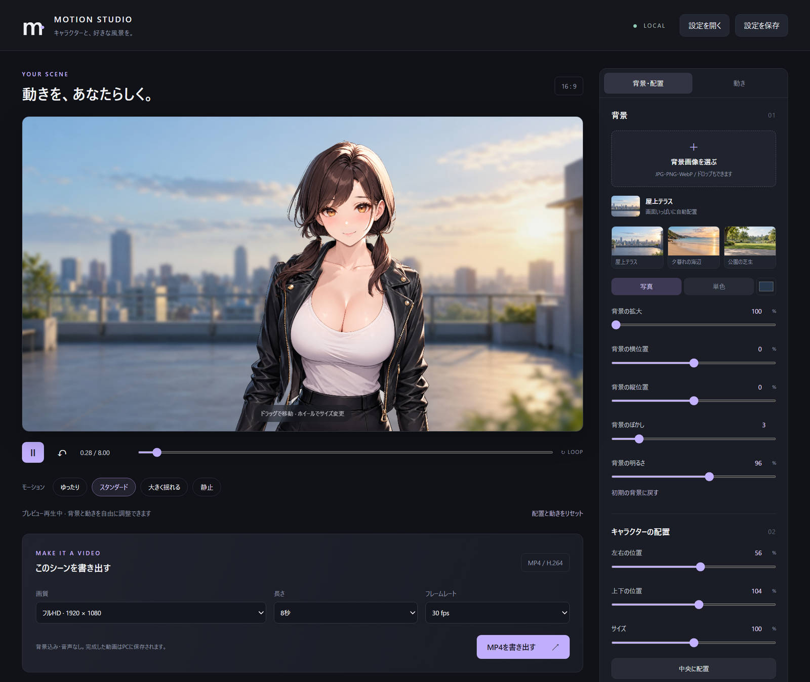

# Motion Studio

> **このアプリはYouTubeの解説動画と連動しています。**
> ChatGPT（GPT-6 Astra）にAfter Effectsを操作させて、一枚のイラストからキャラクターの
> モーションを作る過程を動画で解説しています。そこで作ったモーションを、ブラウザーで
> 動かせるように組み直したのがこのアプリです。
>
> ▶ **解説動画を見る — https://youtu.be/QaR5_RiOtJA**



一枚のイラストから切り出したパーツ画像を組み立てて、揺れるキャラクターアニメーションを
ブラウザー上でプレビューし、MP4として書き出すローカルアプリです。

体の傾き・頭の打ち消し・髪の遅れ・胸元の変形・まばたきをスライダーで調整し、
好きな背景画像と合成して、1920×1080 / 1280×720 のH.264動画を書き出せます。

*A local web app that assembles layered character parts into a swaying 2D animation,
composites it over a background image, and exports MP4. Scroll down for English.*

---

## できること

- 17枚のパーツ画像をリグとして組み立て、リアルタイムにプレビュー
- 体・頭・髪・胸元の揺れ幅と周期、まばたきのオン／オフを調整
- 背景は同梱の3枚（屋上テラス・夕暮れの海辺・公園の芝生）からワンクリックで切り替え。
  手持ちの画像（JPG / PNG / WebP）の読み込み、拡大・位置・ぼかし・明るさの調整、単色背景も可
- MP4書き出し：1920×1080 または 1280×720、24 / 30 / 60 fps、
  長さは 2 / 4 / 8 / 12 / 20 / 30 / 60 秒から選択、H.264、音声なし
- 設定を背景画像ごとJSONに保存・読み込み
- 画像も動画もすべてローカルで処理します。外部への送信はありません

プレビューとMP4は同じ描画処理を使い、フレーム単位で書き出すため、
PCの速度によって動画の速度が変わることはありません。

**ループを滑らかにするコツ**：長さを「揺れの周期」の整数倍にしてください。
まばたきは4秒周期なので、長さを4秒の整数倍にするとまばたきも繋がります。

## 必要なもの

| | |
|---|---|
| Python | 3.10 以降（標準ライブラリのみ。pip install は不要） |
| FFmpeg | PATH が通っていること。MP4書き出しに使います |
| ブラウザー | Chrome / Edge など、WebGLが使えるもの |

FFmpeg が無くてもプレビューまでは動きます。書き出しだけができません。

## 使い方

```sh
git clone https://github.com/taka-pro/motion-studio.git
cd motion-studio
```

```sh
# Windows
start-windows.cmd をダブルクリック

# macOS / Linux
sh start.sh
```

ブラウザーで `http://127.0.0.1:8877` が開きます。手動なら `python server.py --open`、
ポートを変えるなら `python server.py --port 9000` です。

1. 背景を選ぶ。同梱の3枚はサムネイルをクリック、手持ちの画像は「背景画像を選ぶ」から
   読み込むかステージへドロップ（16:9を埋めるように配置されます）
2. キャラクターはドラッグで移動、ホイールで拡大縮小
3. 「動き」タブで揺れ方を調整（ゆったり／スタンダード／大きく揺れる／静止のプリセットあり）
4. 画質・長さ・fpsを選び「MP4を書き出す」。書き出し中は画面を開いたままにしてください
5. 完成動画は `exports/` に保存されます

サーバーを止めるときは、`python server.py` で起動した場合はそのコンソールで Ctrl+C。
`start-windows.cmd` は `pythonw.exe`（コンソールなし）で起動するので、タスクマネージャーで
`server.py` を実行しているPythonプロセスを終了してください。

## 自分のキャラクターを使う

キャラクターの定義は `assets/parts.json` と `renderer.js` の2か所に分かれています。
配置は `parts.json`、動きの支点と変形範囲は `renderer.js` に直接書かれています。

```jsonc
{
  "canvas": [1792, 2240],          // 元イラストの解像度（renderer.jsは参照していない）
  "parts": [
    {
      "name": "01_Body_Base",      // assets/<name>.png と対応
      "visible": true,             // 読み込み時に表示するか
      "parent": "BODY",            // "BODY" か "HEAD"。どちらの動きに追従するか
      "pivot": [896.0, 2040.0],    // 回転の支点（canvas座標）
      "box": [408, 723, 1400, 2240], // PNGが元canvasのどこを占めるか
      "url": "/assets/01_Body_Base.png"
    }
  ]
}
```

- **配列の順番が描画順**です。先頭が最背面になります。
- `parent` が `BODY` のパーツは体の傾きに、`HEAD` のパーツは体の傾き＋頭の打ち消しに
  追従します。
- `pivot` が効くのは髪3枚と腕2枚だけです。他のパーツは回転角が0なので参照されません。
- `box` は全パーツで使われます。

### renderer.js に直接書かれている値

| 場所 | 値 | 意味 |
|---|---|---|
| `render()` | `2240` / `-896` | 元画像の高さと中心X。スケールと中央寄せの基準 |
| `render()` | `[896, 2040]` | 体の回転支点（腰のあたり） |
| `render()` | `[898, 746]` | 頭の回転支点（首のあたり） |
| フラグメントシェーダー | 中心 `(896, 1340)` / 半径 `(405, 425)` | 胸元を変形させる楕円の範囲 |

動かすレイヤーは名前で判定しています。名前が一致しないパーツは静止したまま描画されます。

```
01_Body_Base          胸元の変形をかける対象
02_Arm_ScreenLeft     腕の揺れ
03_Arm_ScreenRight
11_Hair_Front         前髪の揺れ
12_Hair_ScreenLeft    髪の揺れ（遅れ付き）
13_Hair_ScreenRight
*_Eye_*_Open / _Half / _Closed    まばたきの3状態
```

胸元の変形は `01_Body_Base` の楕円範囲にディスプレイスメントマップをかけています。
画像をずらすのではなく変形させているので、服との境目が目立ちません。

### After Effects の書き出しから作り直す

```sh
python tools/prepare_assets.py --src path/to/export --out assets
```

Pillow が必要です。同梱のキャラクターは 1792×2240、17パーツ（胴体・左右の腕・首・顔・口・
左右の眉・左右の目3状態・前髪・左右の髪）です。

## しくみ

- `server.py` — Python標準ライブラリだけのローカルサーバー。`127.0.0.1` のみにバインドし、
  Hostヘッダーを検証、POSTにはワンタイムトークンを要求します。書き出しはブラウザーが
  1フレームずつJPEGをPOSTし、サーバーが FFmpeg の stdin にパイプする方式です。
- `renderer.js` — パーツの合成とアニメーションの計算。プレビューと書き出しで共通です。
- `app.js` — UI、スライダー、設定の保存と復元、書き出しの進行管理。
- `index.html` / `style.css` — 画面。

ビルド手順もパッケージマネージャーもありません。クローンして起動するだけです。

## 制限

- After Effects のプロジェクトを直接実行するものではありません。同じ素材をブラウザー用に
  組み直したものです。
- 揺れを大きくするとパーツの境目が見える場合があります。プレビューを見て調整してください。
- MP4に音声は含まれません。
- MP4から設定を復元することはできません。再編集用には「設定を保存」のJSONを使ってください。
- 書き出しは同時に1件だけです。

## この作品について

Higgsfield の After Effects プラグイン経由で ChatGPT（GPT-6 Astra）に After Effects を
操作させ、一枚のイラストからこのキャラクターモーションを作りました。そのモーションを
ベースに、ブラウザーで動かせるように組み直したのがこのアプリです。

制作の様子は動画にまとめています → **https://youtu.be/QaR5_RiOtJA**

## ライセンス

MIT License（[LICENSE](LICENSE)）。コード・キャラクターのパーツ画像・背景画像のすべてが
対象で、改変も再配布も自由です。同梱画像の出自は
[THIRD_PARTY_NOTICES.md](THIRD_PARTY_NOTICES.md) に記載しています。

---

# Motion Studio (English)

A local web app that assembles layered PNG parts into a swaying 2D character
animation, composites it over a background image, and exports MP4 — no build step,
no npm, no third-party Python packages.

**Requirements:** Python 3.10+, FFmpeg on PATH, a WebGL-capable browser.

```sh
git clone https://github.com/taka-pro/motion-studio.git
cd motion-studio
python server.py --open      # or double-click start-windows.cmd
```

Then open `http://127.0.0.1:8877`.

**Features**

- Real-time preview of a 17-part character rig
- Sliders for body tilt, head counter-rotation, hair lag, chest deformation and
  sway period; blink on/off
- Three bundled backgrounds one click away, or load your own (JPG / PNG / WebP),
  with zoom, offset, blur and brightness — or use a solid colour
- Export H.264 MP4 at 1920×1080 or 1280×720, 24/30/60 fps, 2/4/8/12/20/30/60 s, no audio
- Save and reload settings as JSON, background image included
- Everything runs on your machine. Nothing is uploaded

The exporter renders frame by frame through the same code path as the preview, so
output speed does not depend on machine performance. For a seamless loop, set the
duration to a whole multiple of the sway period (blinks cycle every 4 s).

**Using your own character:** the rig lives in two places. `assets/parts.json`
holds the layout (draw order, `parent`, `pivot`, `box`), and `renderer.js` holds
this character's geometry — canvas height `2240` and centre `896`, body pivot
`[896, 2040]`, head pivot `[898, 746]`, and the chest displacement ellipse
(centre `(896, 1340)`, radii `(405, 425)`). Animated layers are matched by name
(`01_Body_Base`, `02_Arm_ScreenLeft`, `12_Hair_ScreenLeft`,
`*_Eye_*_Open|Half|Closed`, …); a part whose name does not match is drawn
without motion. `parts.json` declares a `canvas` field that the renderer does
not read.

**How the export works:** the browser POSTs one JPEG per frame to a loopback-only
Python server, which pipes them into FFmpeg's stdin. The server binds to
`127.0.0.1`, validates the `Host` header and requires a per-session token on POST.

**License:** MIT — code, character parts and backgrounds alike. See
[THIRD_PARTY_NOTICES.md](THIRD_PARTY_NOTICES.md) for how the images were made.

**Behind this project:** the character motion was built in After Effects by
ChatGPT (GPT-6 Astra) driving the Higgsfield After Effects plugin, then rebuilt
for the browser as this app. Walkthrough video (Japanese):
https://youtu.be/QaR5_RiOtJA
